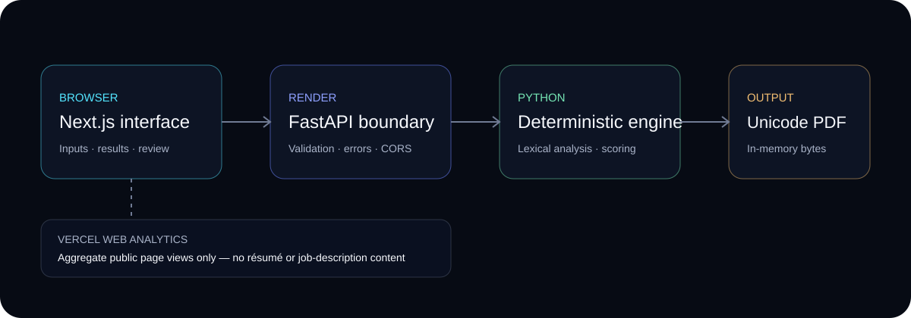

# Resume Keyword Screener

[](https://github.com/J321-D/resume-screener-bot/tree/v2.0.0)
[](#verification)
[](LICENSE)
[](https://resume-keyword-screener.vercel.app)

🚀 **Live Demo (Version 2):** https://resume-keyword-screener.vercel.app

🧰 **Legacy v1.1.2 demo:** https://resume-keyword-screener.streamlit.app

Resume Keyword Screener is a deterministic lexical-analysis tool that compares one or more résumés with a job description to measure deterministic lexical keyword coverage.

It supports PDF, DOCX, and TXT uploads, ATS-aware technical tokenization, phrase and synonym normalization, category-level coverage, interactive visualizations, and Unicode-safe PDF report generation.

The reported scores measure **lexical overlap only**. They are **not** assessments of candidate quality, experience, job performance, hiring suitability, or the behavior of a specific applicant-tracking system.

The tagged [v2.0.0 baseline](https://github.com/J321-D/resume-screener-bot/tree/v2.0.0)
introduced a responsive Next.js client and a narrow FastAPI boundary over the
same deterministic Python engine. The current public V2.x deployment includes
verified post-tag hardening at commit
[`e8e638b`](https://github.com/J321-D/resume-screener-bot/commit/e8e638b971e94f2156e61c3e33e31ccbc00e159d).
The Streamlit v1.1.2 deployment is preserved as a legacy demo and fallback;
Streamlit may require authentication before displaying it.

---

## Features

- 📄 PDF, DOCX, and UTF-8 TXT parsing
- 🎯 ATS-aware technical-term tokenization
- 📊 Skills-focused and v1.0-compatible Full lexical analysis modes
- 🧩 Longest-first phrase recognition
- 🔁 Curated synonym and abbreviation normalization
- 🗂️ Category-level skill coverage
- 📈 Matched and missing keyword visualizations
- 📑 Unicode-safe PDF report generation
- 📱 Responsive desktop and mobile interface
- 🔒 No external AI or résumé-analysis API calls
- ✅ Robust upload validation and user-friendly errors
- 📉 Anonymous aggregate page analytics with no document or form content
- 🧭 Responsive navigation, synthetic demo, searchable Help, and resilient timeout/retry/cancel states
- ⌨️ Command palette, keyboard-first review controls, and evidence-focused category/term inspection
- ◉ Original analysis-core hero with a reduced-motion-safe boot sequence and truthful request timeline
- ⎔ Deterministic analysis fingerprint, résumé/role category blueprint, and Overview/Standard/Dense result views
- ◎ Gap Mode, factual Mission Board progress, resolved-state advancement, and session-only finding notes
- ◫ Result walkthrough/minimap, sticky result waypoints, screen-first Living Report, Showcase Mode, Precision Lab light mode, and factual local performance HUD
- 🛡️ No-store analysis responses, bounded inputs, archive safety checks, and Preview noindex controls
- 🔎 Privacy-bounded Contract v2 with exact matched-term provenance, TRACE,
  Evidence Explorer filters, Machine View, and exact Resume/JD X-Ray over
  request-scoped canonical parser text; v1 remains backward compatible
- 🧭 Conservative semantic sections and a factual per-request diagnostics rail
  without visual-format, severity, readiness, or hiring claims
- ⚗️ Session-only Resume Lab for bounded résumé-variant and before/after
  comparison against one role, with a hangar, timeline, matrix, Diff Reactor,
  per-run review state, and no durable browser or server history
- ✎ Temporary Revision Workspace for editing a browser-memory-only text copy,
  explicitly rerunning it, and comparing the returned result with a chosen baseline

### Version 2 additions

- Responsive Next.js client over the FastAPI application boundary.
- Session-local review of every coverage opportunity using **Add to résumé**,
  **Already represented**, **Not relevant**, and **Review later** statuses.
- Reviewed/remaining progress, factual status totals, filters, and term search.
- Ordered Markdown checklist export for opportunities marked Add to résumé.
- Static Unicode precision-dossier PDF plus a separate print-only Resume Lab
  comparison record assembled from current in-memory runs.
- Automatic decision clearing when changed inputs make the current analysis stale.
- Copyable result summaries and explicitly selected opportunity terms.
- Confirmed New analysis reset, print-friendly output, and stable error/404 recovery.

---

## Screenshots

### Desktop

[](docs/images/desktop.png)

### Mobile

[](docs/images/mobile.png)

> The screenshots show the public Version 2 Next.js results and review experience using synthetic content.



---

## Analysis modes

### Skills-focused analysis

Skills-focused analysis is the default mode. It provides a cleaner relevance-focused comparison by:

- removing a deterministic set of filler words and generic job-posting language
- removing possessive suffixes such as `'s` and `’s`
- recognizing supported two- and three-word phrases longest-first
- preventing recognized phrase components from being counted again from the same text span
- normalizing only explicitly curated synonyms and abbreviations
- preserving original résumé and job-description terms for display
- grouping recognized concepts into curated categories
- retaining unknown meaningful concepts as **Uncategorized**
- explaining normalized matches
- rendering a horizontal matched-versus-missing categorized skills chart

Examples of supported normalization include:

- `QC` → `quality control`
- `QA` → `quality assurance`
- `GMP` → `good manufacturing practice`
- `DOE` → `design of experiments`
- `CAPA` → `corrective and preventive action`
- `SOP` → `standard operating procedure`
- `EBR` → `electronic batch record`
- `bioreactors` → `bioreactor`
- `cell-culture` → `cell culture`

Normalization is intentionally narrow and deterministic. The application does not use stemming, fuzzy matching, embeddings, generative AI, or external analysis APIs.

### Full lexical analysis

Full lexical analysis preserves the v1.0 comparison behavior, including:

- unique-token lexical scoring
- one-decimal score rounding
- strict warning behavior below 30%
- multiple-résumé union behavior
- ATS-aware technical tokenization
- exact missing-keyword frequency ranking
- stable first-appearance tie-breaking
- substring keyword filtering
- existing upload and pasted-text precedence
- legacy filler-word and possessive-token behavior

This mode remains available for backward compatibility and direct lexical inspection.

---

## Coverage calculation

### Skills-focused categorized coverage

The primary Skills-focused score is calculated from categorized job-description concepts only:

```text
categorized matched concepts
──────────────────────────── × 100
categorized JD concepts
```

Uncategorized terms do not affect the primary categorized score.

They remain visible in the matched and missing details and receive their own secondary metric:

```text
Uncategorized lexical coverage
```

If the job description contains no categorized concepts, the primary result displays:

```text
N/A — no categorized concepts
```

A category containing no applicable job-description concepts displays:

```text
N/A — no applicable concepts
```

### Full lexical coverage

Full lexical coverage is calculated as:

```text
matched unique JD tokens
──────────────────────── × 100
all unique JD tokens
```

---

## Coverage categories

Skills-focused mode reports:

- Technical skills
- Quality/regulatory
- Tools/software
- Education
- Experience/action terms
- Uncategorized

The taxonomy is curated rather than universal. Unknown meaningful terms remain visible under **Uncategorized** instead of being silently discarded.

---

## Core functionality

- Upload one or more résumés, paste résumé text, or use both.
- Upload or paste one job description.
- Combine all supplied résumés into one comparison set.
- Preserve technical terms such as `C++`, `C#`, `.NET`, `Node.js`, `cell-culture`, `machine-learning`, and `real-time`.
- Calculate deterministic lexical coverage.
- Display matched and missing terms.
- Rank missing terms by frequency with stable job-description ordering.
- Explain curated phrase, synonym, abbreviation, and singular/plural matches.
- Show category-level coverage.
- Display a horizontal categorized chart showing matched and missing concepts.
- Display a separate missing-keyword frequency chart.
- Filter visible matched and missing terms.
- Generate a Unicode-safe PDF report for either analysis mode.

Multiple uploaded résumés are currently combined into one lexical comparison rather than scored independently.

---

## Upload support and limitations

- Supported formats are PDF, DOCX, and UTF-8 TXT.
- Maximum file size is **10 MB per file**.
- Combined uploaded files are limited to **25 MB per request** and each pasted text field to **200,000 characters**.
- Password-protected, malformed, unsupported, unreadable, and empty files are rejected with concise messages.
- Invalid UTF-8 TXT files are rejected.
- Image-only PDFs are detected when they contain no extractable text.
- OCR is **not** included.
- Scanned documents must be converted to searchable PDFs before upload.
- Unknown MIME types do not silently fall through to TXT parsing.
- DOCX containers are rejected when archive size, entry count, path, encryption,
  or compression-ratio checks indicate decompression abuse.

PDF reports use **Droid Sans Fallback**, supplied through PyMuPDF/MuPDF. It supports accented Latin, Chinese, Japanese, and Korean text without requiring a system font installation.

Characters unavailable in the font are replaced with `?` instead of causing report generation to fail. Complex right-to-left shaping is not explicitly supported.

---

## Requirements

- Python 3.10 or newer
- A local virtual environment is recommended

The application targets Python 3.10 or newer and is verified on Python 3.12 in
CI and production.

---

## Setup

```bash
git clone https://github.com/J321-D/resume-screener-bot.git
cd resume-screener-bot

python3 -m venv .venv
source .venv/bin/activate

python -m pip install --upgrade pip
python -m pip install -r requirements.txt
```

The application does not require an API key. Never commit local environment
files or credentials to Git.

---

## Run

```bash
source .venv/bin/activate
streamlit run app.py
```

Streamlit will display a local URL. Open it in a browser, provide résumé content and a job description, choose an analysis mode, and review the results.

---

## Version 2 development interface

Version 2 is additive: it does not replace or reimplement the Python engine. Run
the API and frontend in separate terminals:

```bash
source .venv/bin/activate
uvicorn api.main:app --reload --port 8000
```

```bash
cd frontend
pnpm install --frozen-lockfile
pnpm dev
```

Copy `frontend/.env.example` to `frontend/.env.local` only when the API is not at
the default `http://localhost:8000`. The API permits local development origins by
default; production origins must be supplied explicitly through its environment.
The client never performs scoring or normalization—it submits validated inputs to
the API and renders the returned ordered contract.

## Project documentation

- [Repository operating manual](AGENTS.md)
- [Product definition](docs/PRODUCT.md)
- [Roadmap](docs/ROADMAP.md)
- [Architecture](docs/ARCHITECTURE.md)
- [Design system](docs/DESIGN_SYSTEM.md)
- [Verification checklist](docs/VERIFICATION.md)
- [Deployment runbook](docs/DEPLOYMENT.md)
- [Architectural decisions](docs/DECISIONS.md)
- [Changelog](docs/CHANGELOG.md)
- [Contributing guide](docs/CONTRIBUTING.md)
- [Security policy](SECURITY.md)
- [Requirement-to-evidence matrix](docs/COMPLETENESS.md)

### Version 2 architecture

```text
frontend/                  Next.js application and browser-facing tests
  app/                     Routes, metadata, and global design system
  components/              Workspace, upload, progress, and result views
  lib/                     Typed API contract and presentation helpers
api/                       FastAPI transport boundary
  routes/                  Health, analysis, and report endpoints
  services/                Upload validation and engine orchestration
resume_screener/           Established deterministic analysis and PDF engine
tests/                     Python engine and API contract tests
```

The repository contains verified release configuration for the public Vercel
frontend and Render API. [`docs/DEPLOYMENT.md`](docs/DEPLOYMENT.md) records the
exact settings, environment boundaries, public origin, and rollback plan. The
Streamlit v1.1.2 application remains online as the legacy interface.

---

## Verification

Run the application integrity and syntax check:

```bash
python3 scripts/check_app.py
```

Verify required imports and dependencies:

```bash
python3 scripts/check_app.py --check-dependencies
```

Run the complete automated test suite:

```bash
MPLCONFIGDIR=/private/tmp/resume-screener-tests \
python -m unittest discover -s tests -v
```

The v1.1.2 release includes **84 automated unittest tests** covering analysis, normalization, scoring, parsing, reporting, models, chart preparation, responsive styles, application behavior, and Python import compatibility.

### Version 2 verification

The final automated check inventory for the current public V2.x baseline is derived
from the fresh verification run below; historical badge counts are not treated as
a substitute for current test evidence.

```bash
MPLCONFIGDIR=/private/tmp/resume-screener-matplotlib-tests \
python -m unittest discover -s tests -v

python scripts/check_app.py
python -m pip check
git diff --check
python -m compileall app.py api resume_screener
python -c "import app; import api.main"

cd frontend
pnpm check
pnpm test:e2e
pnpm audit --prod
```

The application is English-first for lexical normalization. Unicode text is
handled safely end-to-end, but the product does not claim multilingual semantic
analysis, ATS prediction, or hiring assessment.

---

## Manual smoke test

### Full lexical compatibility

1. Start the application:

```bash
streamlit run app.py
```

2. Select **Full lexical analysis**.
3. Paste the following résumé text:

```text
Python SQL
```

4. Paste the following job description:

```text
Python SQL MATLAB
```

5. Confirm:

- coverage is **66.7%**
- `python` and `sql` are matched
- `matlab` is missing

### Skills-focused analysis

1. Select **Skills-focused analysis**.
2. Paste résumé content containing:

```text
QC GMP SOP C++ Node.js cell-culture technical writing
```

3. Paste job-description content containing:

```text
Quality Control
Good Manufacturing Practice
Standard Operating Procedures
C++
Node.js
Cell culture
Technical writing
Process validation
```

4. Confirm:

- normalized-match explanations appear
- phrase components are not listed separately
- category coverage appears
- Uncategorized coverage appears separately
- filler words do not dominate the results
- the categorized chart clearly distinguishes matched and missing concepts
- technical punctuation remains intact

### File and report handling

Upload representative PDF, DOCX, and UTF-8 TXT files and confirm:

- text previews are readable
- malformed files display friendly errors
- image-only PDFs display the OCR limitation message
- PDF reports download and open successfully
- report values match the visible interface

---

## Privacy and security

Résumés often contain sensitive personal information.

- When run locally, document processing occurs in the local application process.
- In the public Version 2 demo, the Vercel frontend sends submitted résumé and
  job-description data to the configured Render API for request-scoped
  processing. The application does not intentionally persist that content;
  framework multipart handling may spool bounded larger uploads to temporary
  storage and closes upload resources when the request completes.
- Contract v2 returns exact canonical parser text to the requesting browser for
  Document X-Ray. It is not anonymized and can be copied or captured by the
  user; application code does not place it in analytics, logs, URLs, or browser
  storage, and the response is marked `no-store`.
- The Version 2 frontend is configured to use Vercel Web Analytics for anonymous aggregate page views,
  referrers, approximate region, browser, operating system, and device category.
  Analytics receives only the exact public origin and fixed page path; query strings, document
  content, filenames, extracted terms, report contents, and form input are
  excluded. No analytics cookies or custom interaction events are used.
- In the legacy v1.1.2 demo, document processing occurs within the Streamlit application runtime.
- Résumé content is not sent to an external AI, embedding, or résumé-analysis API.
- Uploaded content is not intentionally persisted by the application.
- Protect `.env` files and credentials.
- Obtain appropriate permission before processing another person's résumé.

---

## Current limitations

- Multiple résumés are combined rather than scored independently.
- The taxonomy and synonym map are curated, not comprehensive.
- Unknown meaningful concepts may appear under **Uncategorized**.
- Skills-focused mode performs deterministic lexical matching, not semantic understanding.
- Full lexical mode intentionally includes ordinary filler words.
- OCR is unavailable for scanned PDFs.
- Unsupported PDF glyphs may render as `?`.
- Complex right-to-left shaping is not explicitly supported.
- The tool does not predict ATS decisions or hiring outcomes.

---

## Project status

**Resume Keyword Screener V2.x** is the current public release. The
[`v2.0.0`](https://github.com/J321-D/resume-screener-bot/tree/v2.0.0) tag marks
the original public baseline; Production currently runs verified post-tag
hardening at commit
[`e8e638b`](https://github.com/J321-D/resume-screener-bot/commit/e8e638b971e94f2156e61c3e33e31ccbc00e159d).
No later semantic-version tag or GitHub Release has been created. The tagged
v1.1.2 Streamlit release is preserved as the legacy demo.

The legacy v1.1.2 release includes:

- PDF, DOCX, and TXT parsing
- ATS-aware technical tokenization
- two analysis modes
- phrase-component suppression
- possessive cleanup in Skills-focused mode
- curated phrase and synonym normalization
- categorized primary coverage
- separate Uncategorized lexical coverage
- normalized-match explanations
- improved categorized matched/missing charting
- Unicode-safe PDF reports
- Python 3.10+ compatibility, with Python 3.12 used in CI and production
- responsive desktop and mobile layouts
- robust upload validation
- 84 automated unittest tests

The V2.x release is complete and feature-frozen, including the additive FastAPI
boundary, Next.js frontend, premium responsive interface, review workspace,
release hardening, and repository operating documentation. The Vercel/Render
release is public at the Live Demo URL.
The current integrated development verification inventory is **284 checks**: 133 Python/API
tests, 103 frontend unit/accessibility tests, and 48 Playwright checks across
Chromium desktop, Firefox desktop, and an iPhone 13 WebKit project. The
production home-route JavaScript budget is 180 KiB gzip and is enforced after
the Next.js build.

The full historical product program—including visual polish, navigation, review
ergonomics, assistance/feedback, privacy, security, resilience, public assets,
and rejected capability proposals—is reconciled in the
[requirement-to-evidence matrix](docs/COMPLETENESS.md). There is no generic
“future” bucket; unimplemented concepts have a concrete rejection or external
blocker.
