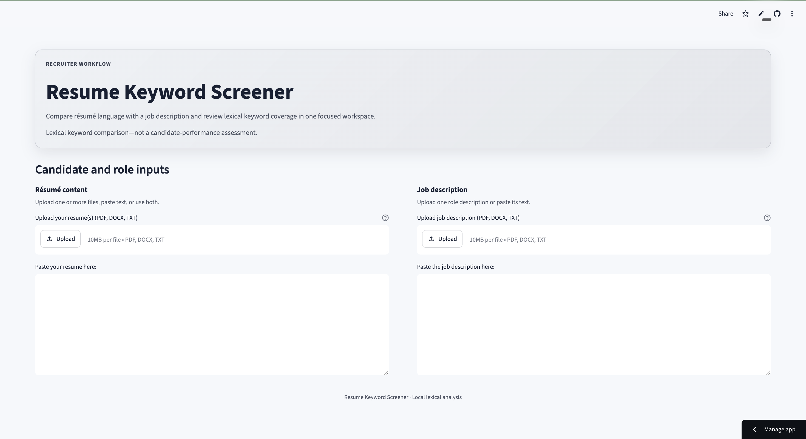
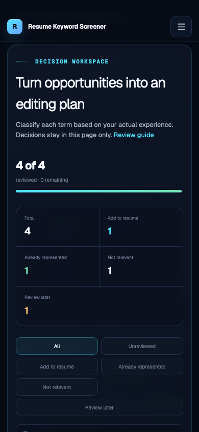

# Resume Keyword Screener

🚀 **Live Demo:** https://resume-keyword-screener.streamlit.app

Resume Keyword Screener is an ATS-style résumé keyword analysis tool that compares one or more résumés with a job description to measure lexical keyword coverage. It supports PDF, DOCX, and TXT uploads, ATS-aware keyword tokenization, interactive visualizations, and Unicode-safe PDF report generation.

The keyword coverage score measures **lexical overlap only**. It is **not** an assessment of candidate quality, experience, qualifications, or hiring suitability.

---

## Features

- 📄 PDF, DOCX, and TXT parsing
- 🎯 ATS-aware keyword tokenization
- 📊 Exact lexical keyword coverage analysis
- 📈 Matched and missing keyword visualizations
- 📑 Unicode-safe PDF report generation
- 📱 Responsive Streamlit interface
- 🔒 Local processing by default
- ✅ Robust upload validation and friendly error handling

---

## Screenshots

### Desktop

[](docs/images/desktop.png)

### Mobile

[](docs/images/mobile.png)

---

## Core functionality

- Upload multiple résumés or paste résumé text.
- Upload or paste one job description.
- Combine all résumé words into one unique keyword set.
- Preserve common punctuated and hyphenated technical terms during tokenization, including `C++`, `C#`, `.NET`, `Node.js`, and `machine-learning`.
- Calculate the percentage of unique job-description keywords found in the résumé set.
- Display matched keywords and rank missing keywords by descending exact-token frequency, using first appearance in the job description as the tie-breaker.
- Render missing-keyword and skill-presence charts.
- Generate a Unicode-safe PDF keyword report.

The GPT toggle, template downloads, peer-review submission, and personalized coaching sections are currently non-functional placeholders reserved for future features.

---

## Upload support and limitations

- Supports PDF, DOCX, and UTF-8 TXT files up to **10 MB** each.
- Password-protected, malformed, unsupported, unreadable, and empty files are rejected with concise user-friendly messages.
- Image-only PDFs are detected when no extractable text exists. OCR is **not** included, so these documents must be converted to searchable PDFs before upload.
- PDF reports use **Droid Sans Fallback** (provided by PyMuPDF/MuPDF), supporting accented Latin, Chinese, Japanese, and Korean text without requiring system font installation.
- Characters not supported by the font are replaced with `?` instead of causing report generation to fail.

---

## Requirements

- Python 3.10 or newer
- A local virtual environment is recommended

---

## Setup

```bash
git clone https://github.com/J321-D/resume-screener-bot.git
cd resume-screener-bot

python3 -m venv .venv
source .venv/bin/activate

python -m pip install --upgrade pip
python -m pip install -r requirements.txt
```

If you plan to experiment with future OpenAI-powered features:

```bash
cp .env.example .env
```

Then add your API key locally. Never commit `.env` or API keys to Git.

The current application performs all résumé analysis locally and does **not** require or use OpenAI.

---

## Run

```bash
source .venv/bin/activate
streamlit run app.py
```

Streamlit will display a local URL. Open it in your browser, provide a résumé and a job description, and review the keyword coverage analysis.

---

## Verification

Verify that the application is installed correctly:

```bash
python3 scripts/check_app.py
```

Verify that all required dependencies are available:

```bash
python3 scripts/check_app.py --check-dependencies
```

The project also includes a comprehensive automated unittest suite.

---

## Manual smoke test

1. Start the application with:

```bash
streamlit run app.py
```

2. Paste `Python SQL` into the résumé field.
3. Paste `Python SQL MATLAB` into the job description field.
4. Confirm the displayed coverage score is **66.7%**.
5. Confirm that `python` and `sql` are matched and `matlab` is missing.
6. Upload representative PDF, DOCX, and TXT files and verify their extracted text.
7. Verify that charts and keyword lists render correctly.

The **66.7%** result is a characterization of the current lexical keyword algorithm and is **not** an endorsement of that scoring model.

---

## Privacy and security

Résumés often contain sensitive personal information.

- All keyword analysis is performed locally by default.
- Resume content is **not** transmitted to external services unless you explicitly modify the application.
- Protect your `.env` file and never commit API keys to source control.
- Always obtain appropriate permission before processing another person's résumé.

---

## Project status

**Resume Keyword Screener v1.0.0** is a stable ATS-style résumé keyword analysis tool supporting:

- PDF, DOCX, and TXT parsing
- ATS-aware keyword tokenization
- Exact lexical keyword coverage analysis
- Unicode-safe PDF report generation
- Responsive Streamlit interface
- Robust upload validation
- 55 automated unit tests

Future releases will focus on additional capabilities while maintaining reliable keyword analysis and report generation.
